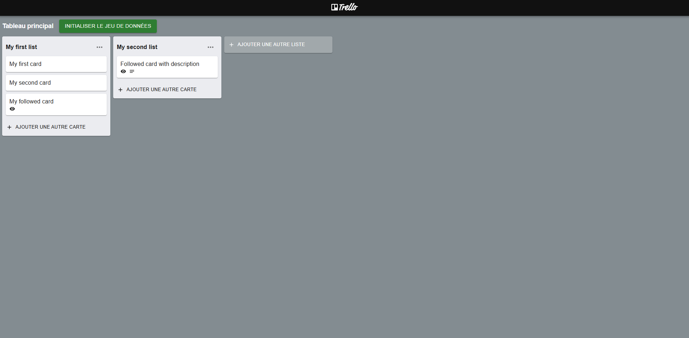

# Test technique Ferway - Réalisé par Buisson Romain

Ce projet a été développé en **Next 15.1.6** avec Material Ui. Il s'agit d'une application simple copiant les fonctionnalitées de base de Trello.


---
## Énoncé
```
# Exercice - développeur JS (Trello/React)

# Énoncé

- L’objectif est de recréer le plus fidèlement possible l'application fournie : https://next-trello.web.app/.
- Le but est d’avoir une application *pixel perfect*
- Il n’est pas demandé d’améliorer l’application
- Il n’y a pas besoin de gérer quelconque base de données
- L’application sera à déployer via Firebase ([Hosting](https://firebase.google.com/products/hosting))

## Points d’attention

- La durée est libre, dans la limite de 24 heures
- Le projet doit utiliser :
    - React
    - Next.js (14 ou 15)
    - Material UI (au moins MUI System - https://mui.com/system/getting-started/usage/)
- Le code livré doit respecter les bonnes pratiques standards de développement (formatage, DRY, séparation des responsabilités, composants atomiques, gestion des erreurs, etc)
- Le livrable est un lien vers le repo avec en README :
    - des indications (exhaustives) sur comment installer et lancer l'application en local
    - un lien de la version en ligne
    - un rapide (et succinct) bilan de l'exercice (2 difficultés, 2 réussites, 2 évolutions possibles)

Le repository doit être hébergé sur Github (ou Gitlab) en accès privé, il faudrait ajouter les handles @sevseux & @NayanChauveau
```

## Prérequis

- Node.js (v20.18 ou supérieur recommandé)
- Un gestionnaire de paquets comme **npm**

---

## Installation

1. Clonez ce dépôt sur votre machine locale :  
   ```bash
   git clone https://github.com/Brozzor/technical-test-ferway.git
   cd technical-test-ferway
   ```

2. Installez les dépendances nécessaires :
    ```bash
    npm install
   ```

3. Lancez le serveur de développement :
    ```bash
   npm run dev
   ```
---

## Utilisation

Une fois le projet démarré, accédez à l'application via : [http://localhost:3000/](http://localhost:3000/)

Vous pouvez également y accéder via cette adresse: [https://ferway-test-acdbb.web.app/](https://ferway-test-acdbb.web.app/)

---

## Bilan

### Difficultés
1. Première expérience avec Next.js, ce qui m'a demandé un certain temps d'adaptation pour maîtriser les concepts du framework.
2. La contrainte de temps (48 heures) pour réaliser ce projet, combinée à d'autres engagements professionnels, m'a contraint à prendre quelques raccourcis.

### Réussites
1. Prise en main assez rapide et satisfaisante du framework Next.js.
2. J'ai particulièrement apprécié l'utilisation de Firebase, qui permet d'héberger un projet de manière simple et rapide.

### Évolutions possibles
1. Intégration d'un système de drag and drop pour permettre le déplacement des cartes.
2. Refactorisation du code afin d'en améliorer la modularité et la lisibilité en découpant davantage les différentes parties.
